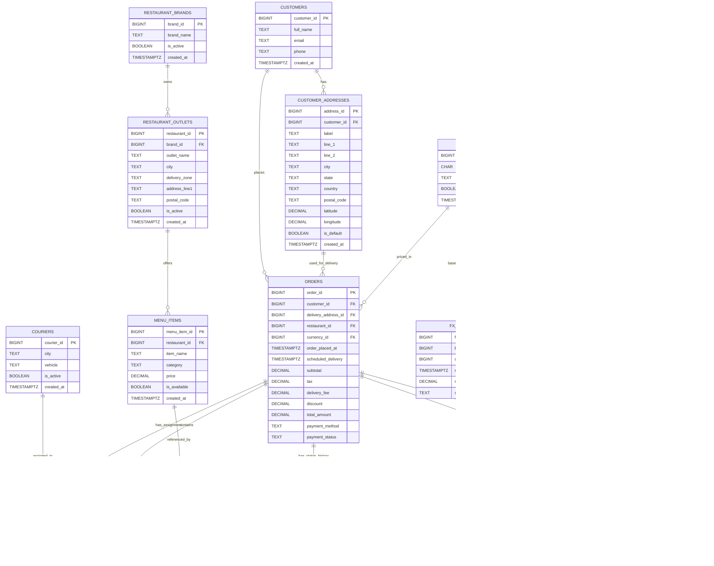
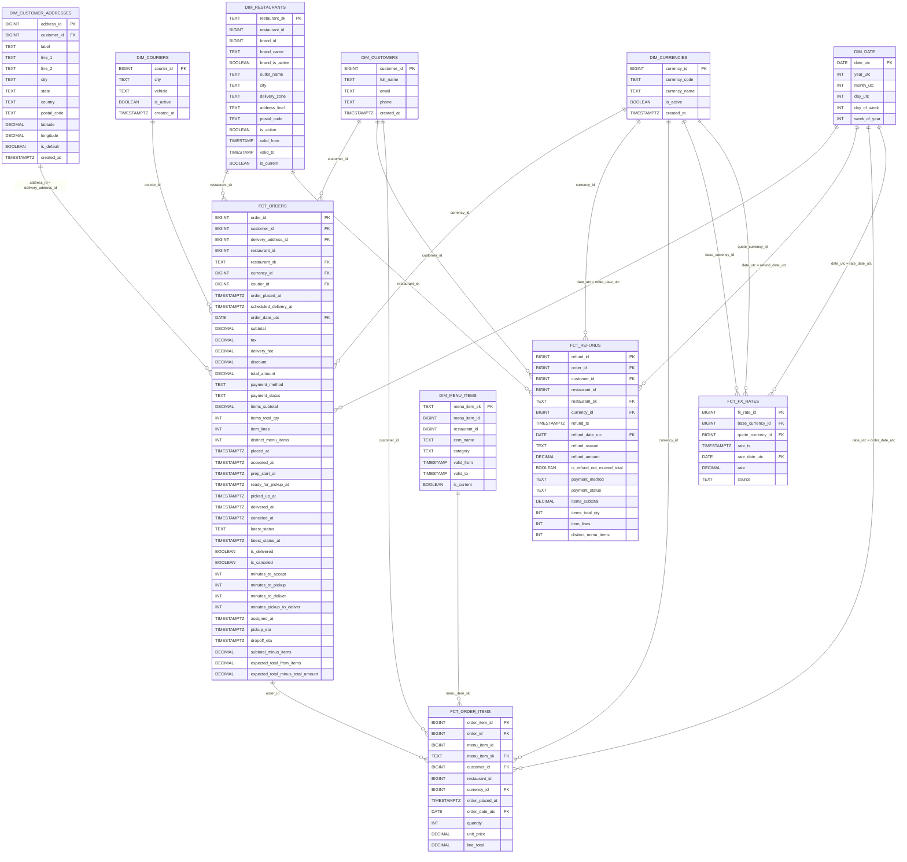

# Food Delivery Analytics Engineering (Postgres → Parquet → DuckDB → dbt)

End-to-end analytics engineering project that:
1) builds an OLTP schema in PostgreSQL  
2) exports OLTP tables to Parquet (bronze)  
3) creates DuckDB `raw.*` views over the Parquet files  
4) runs dbt to build staging → intermediate → gold (dims/facts) models  
5) uses dbt snapshots for slowly-changing dimensions (restaurants, menu items)  
6) validates data quality with dbt tests (schema tests + custom SQL tests)

---

## About this project

This repository is an end-to-end analytics engineering project that simulates a food delivery platform and builds a production-style analytics warehouse locally.

**Goal**
- Start from an OLTP-style source database (PostgreSQL) and produce clean, well-tested analytics tables (DuckDB + dbt) that support reporting and analysis such as order performance, delivery timelines, menu item trends, restaurant changes over time, and refunds.

**What it builds**
- A full pipeline: **Postgres (OLTP) → Parquet (bronze) → DuckDB raw views → dbt staging → dbt intermediate → dbt gold star schema**
- **Staging models** standardize data types, clean strings, and parse timestamps.
- **Intermediate models** compute order rollups, status timelines (placed/accepted/picked up/delivered), delivery enrichment, and reconciliation checks.
- **Gold models** create a star schema:
  - Dimensions (customers, restaurants, menu items, couriers, currencies, date)
  - Facts (orders, order_items, refunds, fx_rates)
- **SCD2 snapshots** track changes to restaurants and menu items over time and join the correct historical version into facts.

**Why this matters (analytics engineering focus)**
- Demonstrates typical warehouse practices: layered modeling, SCD handling, referential integrity tests, business-rule tests, and reproducible local setup.
- The end result is a set of query-ready fact/dimension tables suitable for BI dashboards or ad-hoc analytics.


---

## Tech stack

- PostgreSQL (OLTP source)
- Python (export + automation scripts)
- DuckDB (local analytics warehouse)
- dbt (models + snapshots + tests)
- dbt-utils (test macros)

---

## Prerequisites

### Install Postgres + DuckDB

```bash
brew install postgresql duckdb
brew services start postgresql
```

0) Python environment + dependencies (requirements.txt)
From repo root:

python3 -m venv venv
source venv/bin/activate
pip install -r requirements.txt


1) Create PostgreSQL database + OLTP schema
From repo root:
Create database:
createdb food_delivery

Apply schema files:
psql -d food_delivery -f oltp/schema.sql
psql -d food_delivery -f oltp/new_update_schema.sql

(Optional) Verify tables:
psql -d food_delivery -c "\dt oltp.*"

2) Populate OLTP (optional sample data)
source venv/bin/activate
python oltp/populate_oltp.py

3) Export Postgres → Parquet (bronze layer)

food_delivery_dbt/data/bronze/

python postgres_to_duckdb.py

Expected Outputs:

food_delivery_dbt/data/bronze/
├─ customers.parquet
├─ customer_addresses.parquet
├─ restaurant_brands.parquet
├─ restaurant_outlets.parquet
├─ menu_items.parquet
├─ couriers.parquet
├─ currencies.parquet
├─ delivery_assignments.parquet
├─ ratings.parquet
├─ orders/...
├─ order_items/...
├─ order_status_events/...
├─ refunds/...
└─ fx_rates/...

4) Create DuckDB raw views over Parquet

duckdb food_delivery_dbt/warehouse/food_delivery.duckdb < food_delivery_dbt/warehouse/sql/create_raw_views.sql

Verify:

duckdb food_delivery_dbt/warehouse/food_delivery.duckdb -c "show schemas;"
duckdb food_delivery_dbt/warehouse/food_delivery.duckdb -c "show tables in raw;"
duckdb food_delivery_dbt/warehouse/food_delivery.duckdb -c "select count(*) from raw.orders;"

5) dbt setup

cd food_delivery_dbt

dbt init
dbt deps

6) Configure dbt profile (~/.dbt/profiles.yml)

create/edit:

~/.dbt/profiles.yml

Recommended portable version (uses env var for the DuckDB file path):
food_delivery_dbt:
  target: dev
  outputs:
    dev:
      type: duckdb
      path: "{{ env_var('DUCKDB_PATH') }}"
      threads: 4

Set the env var from inside the dbt project directory:
export DUCKDB_PATH="$(pwd)/warehouse/food_delivery.duckdb"


Confirm dbt can connect:
dbt debug


7) Run snapshots + build models

This project snapshots:

snap_restaurants (restaurant attributes SCD2)
snap_menu_items (menu items attributes SCD2)

Run snapshots:

dbt snapshot

Build everything (models + tests):
dbt build
Other useful commands:

dbt run
dbt test
Data model overview
Bronze (files)
Parquet files in food_delivery_dbt/data/bronze/


Raw (DuckDB views)
raw.* views created by warehouse/sql/create_raw_views.sql


Purpose: expose Parquet as queryable sources for dbt


Staging models (stg_raw__*)
Type casting (IDs, decimals, timestamps)


String cleanup (trim, nullif, upper)


Parsed timestamps into timestamptz


Derived date fields (*_date_utc)


Intermediate models
Orders:
int_orders__items_rollup: item totals and counts at order grain


int_orders__status_rollup: per-status timestamps + SLA metrics


int_orders__delivery_enriched: delivery assignment enrichment


int_orders__reconciliation: expected totals and differences


int_orders__enriched: unified order-grain dataset


Items:
int_order_items__enriched: item grain enriched with order + menu item context


Refunds:
int_refunds__enriched: refund grain enriched with order context + checks


Gold star schema
Dimensions:
dim_customers


dim_customer_addresses


dim_couriers


dim_currencies


dim_date


dim_restaurants (SCD2 snapshot)


dim_menu_items (SCD2 snapshot)


Facts:
fct_orders (order grain, joins restaurant SCD2 at order time)


fct_order_items (order-item grain, joins menu-item SCD2 at order time)


fct_refunds (refund grain with order + rollups)


fct_fx_rates (fx rates enriched with currency codes)


Data quality checks
Schema tests (YAML)
not_null / unique on keys


relationships between facts/dims


accepted_values for enum-like fields


SCD window sanity (valid_to > valid_from, one current row per natural key)


Custom SQL tests (food_delivery_dbt/tests/)
Examples:
FX: no same-currency pair, unique pair+timestamp, positive/reasonable rates


Orders: delivered implies delivered_at exists


Orders: status timestamps are ordered correctly


Orders: total consistency (subtotal + tax + fee - discount ≈ total)


Refunds: refund timestamp after order placed


Refunds: refund does not exceed order total (tolerance)


Run:
dbt test
End-to-end quickstart
From repo root:
brew install postgresql duckdb
brew services start postgresql

python3 -m venv venv
source venv/bin/activate
pip install -r requirements.txt

createdb food_delivery
psql -d food_delivery -f oltp/schema.sql
psql -d food_delivery -f oltp/new_update_schema.sql

python oltp/populate_oltp.py
python postgres_to_duckdb.py

duckdb food_delivery_dbt/warehouse/food_delivery.duckdb < food_delivery_dbt/warehouse/sql/create_raw_views.sql

cd food_delivery_dbt
export DUCKDB_PATH="$(pwd)/warehouse/food_delivery.duckdb"
dbt deps
dbt debug
dbt snapshot
dbt build



```mermaid
flowchart LR
  %% -----------------------
  %% Sources / ingestion
  %% -----------------------
  PG[(PostgreSQL OLTP)] --> PY[postgres_to_duckdb.py]
  PY --> PQ[(Parquet bronze\nfood_delivery_dbt/data/bronze)]
  PQ --> SQLV[create_raw_views.sql]
  SQLV --> RAW[(DuckDB schema: raw\nviews over parquet)]

  %% -----------------------
  %% dbt layers
  %% -----------------------
  RAW --> STG[Staging models\nstg_raw__*]

  %% Staging -> intermediate (orders)
  STG --> INT_ITEMS[int_order_items__enriched]
  STG --> INT_ITEMS_ROLL[int_orders__items_rollup]
  STG --> INT_STATUS[int_orders__status_rollup]
  STG --> INT_DELIVERY[int_orders__delivery_enriched]
  STG --> INT_RECON[int_orders__reconciliation]
  INT_ITEMS_ROLL --> INT_ORDERS[int_orders__enriched]
  INT_STATUS --> INT_ORDERS
  INT_DELIVERY --> INT_ORDERS
  INT_RECON --> INT_ORDERS
  STG --> INT_ORDERS

  %% Intermediate (refunds)
  STG --> INT_REFUNDS[int_refunds__enriched]
  INT_ORDERS --> INT_REFUNDS

  %% Snapshot sources -> snapshots -> dims
  STG --> SNAP_SRC_MI[int_menu_items__snapshot_source]
  STG --> SNAP_SRC_R[int_restaurants__snapshot_source]
  SNAP_SRC_MI --> SNAP_MI[snap_menu_items\n(SCD2 snapshot)]
  SNAP_SRC_R --> SNAP_R[snap_restaurants\n(SCD2 snapshot)]
  SNAP_MI --> DIM_MI[dim_menu_items\n(menu_item_sk SCD2)]
  SNAP_R --> DIM_R[dim_restaurants\n(restaurant_sk SCD2)]

  %% Backfill dims (anchor first record to 1900-01-01)
  DIM_MI --> DIM_MI_BF[dim_menu_items_backfill]
  DIM_R --> DIM_R_BF[dim_restaurants_backfill]

  %% Other dims (type-1 style)
  STG --> DIM_CUST[dim_customers]
  STG --> DIM_ADDR[dim_customer_addresses]
  STG --> DIM_CURR[dim_currencies]
  STG --> DIM_COUR[dim_couriers]
  STG --> DIM_DATE[dim_date]

  %% Facts
  STG --> FCT_FX[fct_fx_rates]
  DIM_CURR --> FCT_FX

  INT_ITEMS --> FCT_OI[fct_order_items]
  DIM_MI_BF --> FCT_OI

  INT_ORDERS --> FCT_O[fct_orders]
  DIM_CUST --> FCT_O
  DIM_ADDR --> FCT_O
  DIM_CURR --> FCT_O
  DIM_R_BF --> FCT_O

  INT_REFUNDS --> FCT_REF[fct_refunds]
  FCT_O --> FCT_REF
  INT_ITEMS_ROLL --> FCT_REF
```




